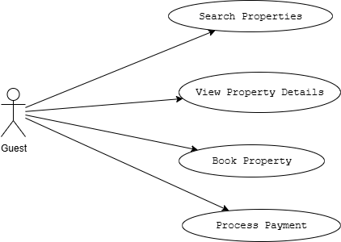

# requirement-analysis
# Requirement Analysis in Software Development

## Purpose of this Repository
This repository documents and demonstrates key aspects of requirement analysis in the software development lifecycle (SDLC). It serves as:
- A reference for best practices in gathering and analyzing software requirements
- A collection of templates for requirement documentation (SRS, use cases, etc.)
- A workspace for analyzing real-world requirement scenarios

## Key Topics Covered
1. Requirement gathering techniques (interviews, surveys, workshops)
2. Functional vs non-functional requirements
3. Use case modeling and user stories
4. Requirement validation and prioritization
5. Tools for requirement management (JIRA, Confluence, etc.)

## Repository Structure

## What is Requirement Analysis?

Requirement Analysis is the critical first phase in the Software Development Life Cycle (SDLC) where stakeholders' needs are systematically gathered, documented, analyzed, and validated before any development begins. It serves as the foundation for all subsequent development activities.

### Key Aspects of Requirement Analysis:
1. **Elicitation**  
   - Gathering requirements through techniques like:  
     • Stakeholder interviews  
     • User surveys  
     • Workshops  
     • Market research  

2. **Specification**  
   - Documenting requirements in clear, measurable terms using:  
     • Software Requirements Specifications (SRS)  
     • User stories  
     • Use case diagrams  

3. **Validation**  
   - Ensuring requirements are:  
     • Complete (cover all needed functionality)  
     • Consistent (no contradictions)  
     • Feasible (technically/budgetarily achievable)  

4. **Prioritization**  
   - Ranking requirements by:  
     • Business value  
     • Implementation complexity  
     • Regulatory needs  

### Importance in SDLC:
- **Reduces rework** by catching ambiguities early (fixing a requirement error in analysis phase costs 100x less than in production)
- **Aligns stakeholders** through clear documentation that serves as a single source of truth
- **Guides architecture** by defining system constraints and capabilities upfront
- **Prevents scope creep** through controlled requirement change processes
- **Enables accurate estimation** of timelines and resources

> *"The hardest single part of building a software system is deciding what to build."* - Fred Brooks, Author of *The Mythical Man-Month*

## Why is Requirement Analysis Important?

Requirement Analysis is the cornerstone of successful software development. Here are three critical reasons why it's indispensable in the SDLC:

### 1. Prevents Costly Rework
- **Impact**: Fixing errors during development is 5-10x more expensive than correcting them in requirements phase
- **Example**: A misunderstood requirement that surfaces during testing may require architectural changes
- **Data**: Studies show 70% of software failures trace back to poor requirement analysis

### 2. Ensures Stakeholder Alignment
- **Impact**: Creates a shared vision between business teams and developers
- **Mechanism**: 
  - Documents exact business needs
  - Provides measurable acceptance criteria
  - Serves as legal contract between parties
- **Result**: Prevents "That's not what we asked for" scenarios post-launch

### 3. Enables Accurate Planning
- **Impact**: Directly affects project timelines and resource allocation
- **Benefits**:
  - Allows realistic estimation of development effort
  - Identifies dependencies early
  - Reveals potential risks before coding begins
- **Outcome**: Projects with thorough requirement analysis are 3x more likely to deliver on time

> **Real-world Case**: The 1999 Mars Climate Orbiter failure ($327M loss) was ultimately traced to unspecified unit conversion requirements between teams.

## Key Activities in Requirement Analysis

Requirement Analysis consists of five systematic activities that transform vague needs into actionable specifications:

### 1. Requirement Gathering
- **Objective**: Collect raw input from all stakeholders
- **Techniques**:
  - Stakeholder interviews (1-on-1 sessions with key users)
  - Surveys (large-scale needs assessment)
  - Document analysis (reviewing existing systems/processes)
- **Output**: Initial requirement wishlist

### 2. Requirement Elicitation
- **Objective**: Refine and clarify gathered requirements
- **Techniques**:
  - Brainstorming sessions (group ideation)
  - Prototyping (quick mockups to validate concepts)
  - Observation (studying users in their workflow)
- **Output**: Prioritized, conflict-free requirements

### 3. Requirement Documentation
- **Objective**: Create formal, shareable artifacts
- **Deliverables**:
  - Software Requirements Specification (SRS) document
  - User stories with acceptance criteria
  - Use case diagrams (visual workflows)
- **Standard**: Follows IEEE 830 format for SRS

### 4. Requirement Analysis and Modeling
- **Objective**: Structure requirements for implementation
- **Methods**:
  - Data flow diagrams (system interactions)
  - Entity-Relationship diagrams (database structure)
  - State transition diagrams (system behavior)
- **Tools**: UML, BPMN, or SysML notations

### 5. Requirement Validation
- **Objective**: Ensure requirements are correct/complete
- **Techniques**:
  - Walkthroughs (step-by-step review with stakeholders)
  - Traceability matrix (mapping requirements to sources)
  - Feasibility analysis (technical/budget assessment)
- **Success Metric**: Signed-off requirement baseline

## Types of Requirements

### Functional Requirements (What the system does)
*Definition*: Specific behaviors or functions the system must perform

**Booking System Examples**:
1. **User Authentication**  
   - "The system shall allow users to register using email and password"  
   - "The system shall implement password recovery via email"

2. **Property Search**  
   - "The system shall filter properties by location, price range, and availability dates"  
   - "The system shall display search results with pagination (10 listings per page)"

3. **Booking Management**  
   - "The system shall allow guests to reserve properties for specific date ranges"  
   - "The system shall send booking confirmation emails within 2 minutes of reservation"

4. **Payment Processing**  
   - "The system shall integrate with PayPal and Stripe for payments"  
   - "The system shall generate invoices for completed bookings"

### Non-Functional Requirements (How the system performs)
*Definition*: Quality attributes and constraints that affect system operation

**Booking System Examples**:
1. **Performance**  
   - "Search results shall load within 1.5 seconds for 95% of queries"  
   - "The system shall handle 1000 concurrent users during peak hours"

2. **Security**  
   - "All payment transactions shall use TLS 1.2+ encryption"  
   - "User passwords shall be stored using bcrypt hashing"

3. **Reliability**  
   - "The booking system shall maintain 99.9% uptime"  
   - "No more than 0.1% of transactions may fail due to system errors"

4. **Usability**  
   - "First-time users shall complete bookings within 5 minutes without training"  
   - "The interface shall comply with WCAG 2.1 AA accessibility standards"

5. **Scalability**  
   - "The system shall support 20% annual growth in property listings"  
   - "Database queries shall maintain sub-second response times with 50,000 properties"
  
     ## Use Case Diagrams

### What are Use Case Diagrams?
Visual representations that:
- Show interactions between **actors** (users/systems) and the system
- Outline **use cases** (system functionalities)
- Demonstrate system scope and requirements at a high level

**Key Benefits**:
- Clarifies system boundaries
- Identifies all user roles
- Reveals functional requirements
- Serves as communication tool between stakeholders

### Booking System Use Case Diagram

**Diagram Components**:
1. **Actors**:
   - Guest (unauthenticated user)
   - Registered User
   - Property Host
   - Payment Gateway (external system)

2. **Core Use Cases**:
   - Search Properties
   - Book Property
   - Manage Listing (Host)
   - Process Payment
   - Write Review

3. **Relationships**:
   - Includes/extends relationships show dependency between actions
   - Generalization shows inherited behaviors

To create/modify this diagram:
1. Open [Draw.io](https://app.diagrams.net/)
2. Use UML use case shapes
3. Export as PNG (800x600 recommended)

   ## Acceptance Criteria

### What are Acceptance Criteria?
Clear, testable conditions that determine when a requirement or user story is considered complete. They serve as the "definition of done" for development teams and quality assurance.

### Importance in Requirement Analysis:
1. **Alignment** - Bridges communication gaps between stakeholders and developers
2. **Quality Control** - Provides measurable standards for testing
3. **Scope Management** - Prevents feature creep by defining exact deliverables
4. **Automation** - Enables creation of precise test cases

### Characteristics of Good Acceptance Criteria:
- **Specific**: "The system shall display loading animation" vs "The system shall be fast"
- **Measurable**: "Within 2 seconds" vs "Quickly"
- **Achievable**: Technically feasible within constraints
- **Relevant**: Directly tied to business value
- **Time-bound**: Specifies when applicable (e.g., "during peak hours")

### Example: Checkout Feature
**User Story**:  
"As a guest, I want to complete my booking payment securely so I can confirm my reservation."

**Acceptance Criteria**:
1. **Payment Flow**:
   - [ ] When valid credit card details are entered, display success confirmation within 3 seconds
   - [ ] When payment fails, show specific error (insufficient funds/expired card) with retry option

2. **Validation**:
   - [ ] Reject submissions with empty required fields (card number, CVV, expiry date)
   - [ ] Auto-format card numbers as 4-4-4-4 digits during input

3. **Security**:
   - [ ] Never store raw credit card numbers in application logs
   - [ ] Mask all but last 4 digits in confirmation emails

4. **Edge Cases**:
   - [ ] Handle concurrent booking attempts for same property dates
   - [ ] Maintain booking hold for 15 minutes during payment processing

5. **Confirmation**:
   - [ ] Send PDF itinerary to guest email within 5 minutes
   - [ ] Update property calendar in real-time after successful payment
